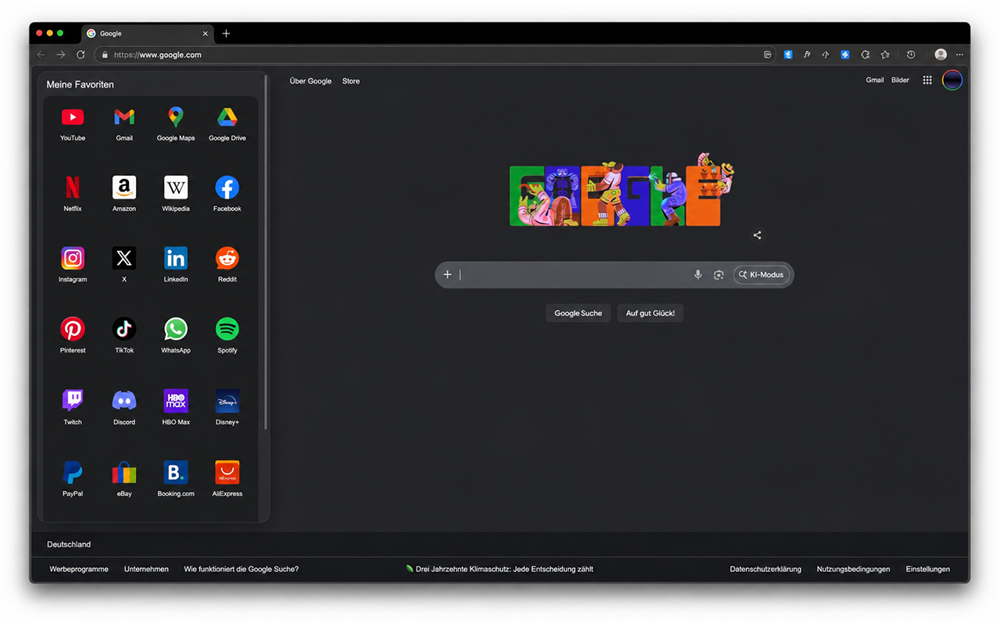

# Favorites Sidebar for Google Search

A small Microsoft Edge extension that puts your Edge favorites next to Google Search.

On wide Google Search home pages, the extension shows a compact favorites sidebar on the left and shifts Google Search to the right. On search results pages and smaller windows, it switches to a small launcher button so it does not cover the search UI. New tabs are redirected to `https://www.google.com/`.

This extension is an independent project and is not affiliated with, endorsed by, sponsored by, or approved by Google LLC, Microsoft Corporation, or the Microsoft Edge team.

## Screenshot



## Features

- Shows favorites from your Edge favorites bar on Google Search.
- Uses a permanent left sidebar on wide Google Search home pages.
- Falls back to a compact launcher button on search results and small windows.
- Redirects new tabs to `https://www.google.com/`.
- Uses local browser favicons where available.
- Replaces missing favicons with stable, flat pastel dots.
- Runs only on Google Search pages, not on Gmail, Calendar, Photos, Drive, or other Google apps.

## Important Disclosures

- The extension changes the Microsoft Edge new-tab page and redirects new tabs to `https://www.google.com/`.
- This change is reversible: disable or remove the extension from `edge://extensions` to restore the previous new-tab behavior.
- The extension reads the browser favorites bar locally to display those links on Google Search pages.
- Bookmark titles and URLs are rendered into the Google Search page DOM while the sidebar or launcher is visible.
- The extension does not include analytics, ads, tracking code, or a remote backend.

## Install for Development

1. Open Microsoft Edge.
2. Go to `edge://extensions`.
3. Enable **Developer mode**.
4. Click **Load unpacked**.
5. Select the `edge-google-favorites-extension` folder.
6. Open `https://www.google.com/` or `https://www.google.de/`.

## Package for Edge Add-ons

Build a store-ready zip package:

```bash
./scripts/package-extension.sh
```

The package is written to `dist/` and should contain the files inside `edge-google-favorites-extension`, not the project root.

## Permissions

- `bookmarks`: reads your Edge favorites bar so the extension can display those links.
- `favicon`: reads favicons from the browser favicon cache.
- Host permissions for `google.com` and `google.de`: injects the sidebar or launcher only on Google Search pages.
- `chrome_url_overrides.newtab`: redirects new tabs to `https://www.google.com/`.

## Privacy

See [PRIVACY.md](PRIVACY.md).

## Legal Notices

See [LEGAL.md](LEGAL.md).

## Store Listing

Draft copy for Microsoft Edge Add-ons is in [EDGE_STORE_LISTING.md](EDGE_STORE_LISTING.md).

## License

No open-source license has been selected. Unless a license is added later, all rights are reserved by the copyright holder.
